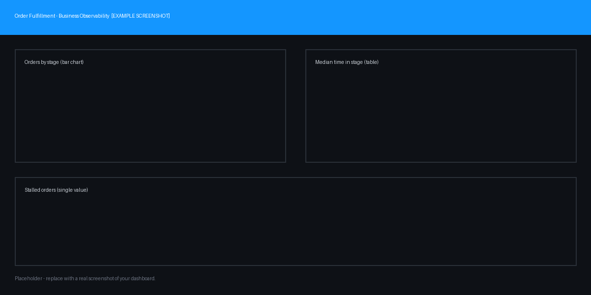

# Order Fulfillment – Business Observability

> See where orders get stuck across the fulfillment lifecycle — from checkout to delivery — using only log and business-event data.

## What it does

This dashboard gives operations and business teams a single view of the order fulfillment funnel: how many orders enter each stage (placed → paid → picked → packed → shipped → delivered), where they stall, and how long each stage takes. It turns raw fulfillment logs into a decision-ready picture of where revenue is at risk, without requiring any custom instrumentation beyond log ingestion.

**Audience:** retail/e-commerce operations teams, SREs supporting order systems, and business stakeholders.

## Screenshots

## Prerequisites

- Dynatrace SaaS with **Grail** and **Logs** enabled.
- Fulfillment logs ingested with an `order_stage` attribute (or adjust the parse step — see Configuration).
- Permission to view logs and create/import dashboards.

## Setup

1. Download [`dashboard.json`](./dashboard.json) from this folder.
2. In Dynatrace, open the **Dashboards** app → **Upload** → select the JSON.
3. Open the dashboard and set the **environment** variable to your target environment.

## Configuration

- **`environment` variable** — pre-set to `production, staging`; edit the values to match your environment names.
- **Log source / parsing** — the tiles assume an `order_stage` field. If your logs use a different field name or format, update the `parse` / `filter` steps in each tile's DQL.
- No tenant-specific IDs are hard-coded; the dashboard is portable across tenants as-is.

## Notes & limitations

- Built and validated against **synthetic** fulfillment logs; tune thresholds to your real volumes.
- Stage timing assumes each order emits one log line per stage transition.

## Related solutions

- Pairs well with a log-ingestion blueprint in [`observability-blueprints/`](../../observability-blueprints/).
